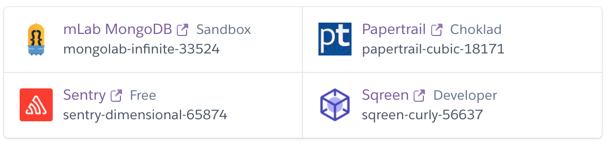

# Short On Time
## Website:
https://short-on-time.herokuapp.com/

## Code Pattern and Style:

Function: camelCase()

Parameters: under_score

Indentation: tabs

## Notes, Backlog, and More:

Notes from initial meeting (02/18): https://docs.google.com/document/d/1CVeDTN6VOdUZ40mTscEKDfuYHaGvAXayfUZkCBnGxt0/edit

Trello: https://trello.com/shortontime/home

Invite Link to Trello: https://trello.com/invite/b/KGSu3zQH/95c28553101326c62bacbd52fafd02ea/user-stories

## Config File

Backend: at config/config.js, with the Heroku URL to the MongoDB service.

Frontend: at client/src/components/config.js, with Stripe key and localhost port (for development purposes).

Stripe Key (located at client/src/components/config.js, line 6 for LIVE key, line 10 for TEST key): pk_test_cKZ9ArATTFDXKwpXTE7SrSB800xveSplrK

## Admin login credentials

admin2@admin2.com, password: 123

All other newly registered users will be is_premium:false, is_admin: false

## Environmental Variables

Located at source root (.env), with SKIP_PREFLIGHT_CHECK=true, parameter to skip a mismatch of module versions.

# Routes
## Users (/api/users)
 - **POST** *users/signup* registers a new account
 - **POST** *users/signin* attempts to sign user in
 - **POST** *users/user_premium* makes regular user premium
 - **POST** *users/contact* sends contact body message to admin
 - **GET** *users/get_remedy_preview/:name* shows only pertinent remedy information
 - **GET** *users/get_remedy_preview* shows list of remedies
 - **GET** *users/get_remedy_full/:name* includes premium information
 - **GET** *users/get_remedy_full* includes premium information
 - **GET** *usesrs/get_glossary/:title* shows glossary item
 - **GET** *users/get_glossary* shows list of glossary items
 - **GET** */get_blog_newest'*
 - **GET** */get_blog/:id'*
 - **GET** */get_blog_previous/:id'*
 - **GET** */get_blog_next/:id'*
 - **GET** */view_self'*
 - **POST** */edit_self'*
 - **DELETE** */delete_self'*

## Admin (/api/admin)
 - **POST** */add_remedy*
 - **PUT** */update_remedy/:id*
 - **GET** */get_remedy/:id*
 - **GET** */get_remedy*
 - **DELETE** */delete_remedy/:id*
 - **PUT** */free_trial*
 - **POST** */add_testimonial*
 - **POST** */add_email_newsleter*
 - **POST** */change_premium_caption*
 - **GET** */get_premium_caption*
 - **POST** */change_welcome_caption'*
 - **GET** */get_welcome_caption'*
 - **POST** */change_disclaimer_caption'*
 - **GET** */get_disclaimer_caption'*
 - **POST** */add_glossary'*
 - **PUT** */update_glossary/:id'*
 - **GET** */get_glossary/:id'*
 - **GET** */get_glossary'*
 - **DELETE** */delete_glossary/:id'*
 - **POST** */add_user'*
 - **PUT** */update_user/:id'*
 - **GET** */get_user/:id'*
 - **GET** */get_user'*
 - **DELETE** */delete_user/:id'*
 - **POST** */add_blog'*
 - **PUT** */update_blog/:id'*
 - **GET** */get_blog/:id'*
 - **GET** */get_blog'*
 - **DELETE** *'/delete_blog/:id'*

## Stripe
 - **POST** */charges'*
 - **POST** */charges_type'*
 - **POST** */change_charges_type'*
 - **GET** */get_charges_type/:type'*

## Image
 - **POST** *image/add_image* adds a image + its name to the database
 - **GET** *image/get_image/:name* gets the image with the same name
 - **GET** *image/get_image* gets a list of image names + ids
 - **DELETE** *image/delete_image/:name* deletes the image with the same name
 - **GET** *image/load_image/:id* gets the image, or a default one

## Forum
 - **GET** */get_post'*
 - **GET** */get_post/:id'*
 - **GET** */get_comment/:post_id/:comment_id'*
 - **POST** */add_post'*
 - **PUT** */edit_post/:id'*
 - **DELETE** */delete_post/:id'*
 - **POST** */add_comment/:post_id'*
 - **PUT** */edit_comment/:post_id/:comment_id'*
 - **DELETE** */delete_comment/:post_id/:comment_id'*
 - **GET** */view_user'*
 - **GET** */view_user/:id'*

# Project Handoff Guidelines - Suggestions beyond Heroku

