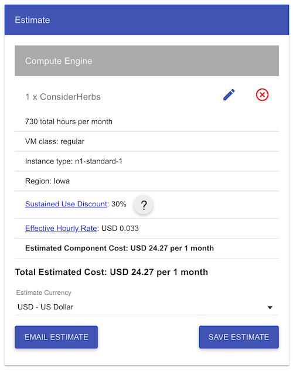
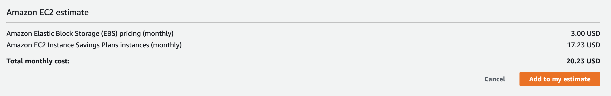

# Short On Time

## Website:
https://short-on-time.herokuapp.com/

## Code Pattern and Style:

Function: camelCase()

Parameters: under_score

Indentation: tabs

## Notes, Backlog, and More:

Notes from initial meeting (02/18): https://docs.google.com/document/d/1CVeDTN6VOdUZ40mTscEKDfuYHaGvAXayfUZkCBnGxt0/edit

Trello: https://trello.com/shortontime/home

Invite Link to Trello: https://trello.com/invite/b/KGSu3zQH/95c28553101326c62bacbd52fafd02ea/user-stories

## Config File

Backend: at config/config.js, with the Heroku URL to the MongoDB service.

Frontend: at client/src/components/config.js, with Stripe key and localhost port (for development purposes).

Stripe Key (located at client/src/components/config.js, line 6 for LIVE key, line 10 for TEST key): *pk_test_cKZ9ArATTFDXKwpXTE7SrSB800xveSplrK*

## Admin login credentials
**admin2@admin2.com, password: 123**

All other newly registered users will be is_premium:false, is_admin: false

## Environmental Variables

Located at source root (.env), with SKIP_PREFLIGHT_CHECK=true, parameter to skip a mismatch of module versions.

# Routes
## Users (/api/users)
 - **POST** *users/signup* registers a new account
 - **POST** *users/signin* attempts to sign user in
 - **POST** *users/user_premium* makes regular user premium
 - **POST** *users/contact* sends contact body message to admin
 - **GET** *users/get_remedy_preview/:name* shows only pertinent remedy information
 - **GET** *users/get_remedy_preview* shows list of remedies
 - **GET** *users/get_remedy_full/:name* includes premium information
 - **GET** *users/get_remedy_full* includes premium information
 - **GET** *usesrs/get_glossary/:title* shows glossary item
 - **GET** *users/get_glossary* shows list of glossary items
 - **GET** */get_blog_newest* gets newest blog post
 - **GET** */get_blog/:id* gets specific blog post, by ID
 - **GET** */get_blog_previous/:id* gets specific blog post, by ID
 - **GET** */get_blog_next/:id* gets specific blog post, by ID
 - **GET** */view_self* views logged user info
 - **POST** */edit_self* edit logged user info
 - **DELETE** */delete_self* delete logged user

## Admin (/api/admin)
**Remedy routes**
 - **POST** */add_remedy*
 - **PUT** */update_remedy/:id*
 - **GET** */get_remedy/:id*
 - **GET** */get_remedy*
 - **DELETE** */delete_remedy/:id*
 - **PUT** */free_trial*
 **Testimonial routes**
 - **POST** */add_testimonial*
 **Newsletter routes**
 - **POST** */add_email_newsleter*
 **Home caption routes**
 - **POST** */change_premium_caption*
 - **GET** */get_premium_caption*
 - **POST** */change_welcome_caption*
 - **GET** */get_welcome_caption*
 - **POST** */change_disclaimer_caption*
 - **GET** */get_disclaimer_caption*
 **Glossary routes**
 - **POST** */add_glossary*
 - **PUT** */update_glossary/:id*
 - **GET** */get_glossary/:id*
 - **GET** */get_glossary*
 - **DELETE** */delete_glossary/:id*
 **User routes**
 - **POST** */add_user*
 - **PUT** */update_user/:id*
 - **GET** */get_user/:id*
 - **GET** */get_user*
 - **DELETE** */delete_user/:id*
 **Blog routes**
 - **POST** */add_blog*
 - **PUT** */update_blog/:id*
 - **GET** */get_blog/:id*
 - **GET** */get_blog*
 - **DELETE** *'/delete_blog/:id*

## Stripe (/api/stripe)
 - **POST** */charges*
 - **POST** */charges_type*
 - **POST** */change_charges_type*
 - **GET** */get_charges_type/:type*

## Image (/api/image)
 - **POST** *image/add_image* adds a image + its name to the database
 - **GET** *image/get_image/:name* gets the image with the same name
 - **GET** *image/get_image* gets a list of image names + ids
 - **DELETE** *image/delete_image/:name* deletes the image with the same name
 - **GET** *image/load_image/:id* gets the image, or a default one

## Forum (/api/forum)
 - **GET** */get_post*
 - **GET** */get_post/:id*
 - **GET** */get_comment/:post_id/:comment_id*
 - **POST** */add_post*
 - **PUT** */edit_post/:id*
 - **DELETE** */delete_post/:id*
 - **POST** */add_comment/:post_id*
 - **PUT** */edit_comment/:post_id/:comment_id*
 - **DELETE** */delete_comment/:post_id/:comment_id*
 - **GET** */view_user*
 - **GET** */view_user/:id*

# Project Handoff Guidelines - Suggestions beyond Heroku

We have successfully added three additional add-ons on top of MongoDB on Heroku. Those add-ons (Sentry and Sqreen) are extremely useful for debugging and finding potential leaks in the app. The Papertrail add-on is also useful to save and check the server logs of the application. With that said, the first suggestion would be to find similar add-ons support if the app gets moved to another PaaS, such as Amazon Web Services (AWS), Microsoft Azure or Google App Engine (GAE).

## AWS (https://aws.amazon.com)

The Amazon platform is much more complex to deploy and manage than Heroku's. However, AWS can give you greater detail and flexibility in terms of pricing, what is going to be charged (usually you will pay only what you use, in terms of server resources), and provides you a greater uptime than the other options. If you decide to go with AWS, keep in mind that you will possibly have to hire a DevOps engineer to take care of the infrastructure, in case the app gets more complex.

## GAE (https://cloud.google.com/appengine)

Offering the same level (or very close) of detail as AWS, the Google App Engine is great for deploying simpler apps that could require a sophisticated approach. Deploying on GAE can also give you a flexible pricing (usually cheaper than Heroku), and still offering tons of Google resources, such as analytics and even Machine Learning modules one click away of being installed in your app. However, deploying on GAE is not as simple as deploying on Heroku, but offers a competitive edge when compared to AWS.

# Price estimations
Note: both services offer free tiers, so you would be able to test the PaaS first.
## GAE

## AWS

# Development and deploys

We have custom scripts that helped us in the development of the app and are essential to the deployment on Heroku. Running *npm run +*:

- **start** *starts the application on current context (if at the root folder, starts the backend; if at the client folder, starts the frontend)*
- **heroku-postbuild** *runs automatically on Heroku*
- **start-dev** *starts the entire web app, both frontend and backend*
- **prepDB** *laods glossary and remedies into the application*
- **install-all** *install all dependencies (both backend and frontend)*
